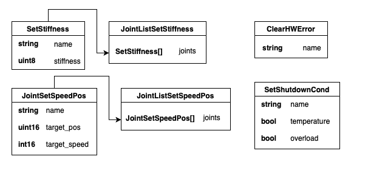
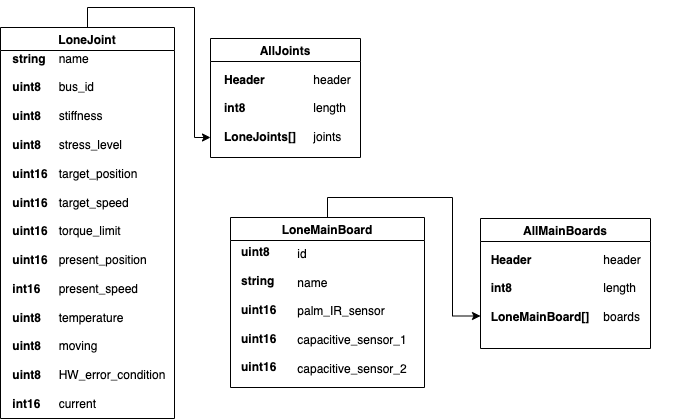

#################### ROS_ROBOTHANDS ####################
########################################################

#################### PROJECT DESCRIPTION ###############
########################################################
This project includes 2 custom ROS packages to ease the use of Seed Robotics products with ROS.

The first package is named "seed_robotics". It allows the user to communicate with a Seed Robotics robotic hand. Communication includes continuous reading in motors memory and making these informations available using ROS messages. This package also allows the user to write to the motors using ROS messages, the user will be able to change the position and the speed of several motors at the same time. It will also be possible to change the stiffness of a motor, to clear its hardware error and to change its shutdown conditions. The instructions for the use of this package will follow. These communications can be done by the user either using command lines, or using Python script (using the rospy library) or CPP project (using rocpp library). There are examples on how to use these different features using python scripts in the src/seed_robotics/user_samples folder. These samples will be explained later. Note that this package allows a working frequency of 50Hz.

The second package is name "sensor_pkg". It eases the communication with Seed Robotics FTS3 and FTS1 pressure sensors using ROS. This package was already available on Github, but here is the latest version, and also the one that allows the user to use it in combination with the ROS package for the Hand control. The sensor_pkg can also be used alone if needed. Its features are the realtime reading of informations sent by the sensor through ROS messages. The sensor_pkg also allows the user to send command to the sensors, either via command lines or using Python script (using the rospy library) or CPP project (using rocpp library). There are examples on how to use these different features using python scripts in the src/sensor_pkg/user_example folder. These samples will be explained later.

There also is a 3rd package in the src/ folder, that is the dynamixel_sdk package which is a library on which the "seed_robotics" package relies.

######################## INSTALLATION ##################
########################################################

In order to work with this package, you must intall ROS Noetic.
Please follow the instructions on the ROS Wiki website here http://wiki.ros.org/noetic/Installation. Please install the desktop-full version.
Please note that this version of the package has only been tested on Ubuntu 20.04.

In order to make this package work, you also need to have Python3 installed. This package have been developped using Python 3.8.10.
You also need to install the following python libs :
- rospy (should have been installed with ROS Noetic)
- std_msgs (should have been installed with ROS Noetic)
- pyserial
- numpy

Once this is done you can clone the root folder of this project. (i.e this folder)
Then, in this folder, open a terminal and type the following command :

"catkin_make"

Afterwards, you NEED to SOURCE your workspace. To do so, in the root folder type

source devel/setup.*    (* Being your CLI, for example setup.bash)

Note that if you want to use this package features in other terminal windows you will have to source each of these terminals aswell.

In order to make the "seed_robotics" package to work at 50Hz, you must change the latency timer of the FTDI chip. To do so you must type the following command each time you plug something on a serial port :

"sudo gedit /sys/bus/usb-serial/devices/$(YOUR_SERIAL_PORT)/latency_timer" And change the value in the file to 1.

Now you should be able to work with the ROS Packages "seed_robotics" and "sensor_pkg".

############### LAUNCHING THE PACKAGES #################
########################################################

To use these packages in the correct way, you must use the "roslaunch" command line.
In the seed_robotics package, there are 10 different launchfiles. You can find them in the /src/seed_robotics/launch/ folder.
Each launchfile have the name "RH6/7/8_L/R/RL.launch". The number depends on the hand model you're using. The "R/L/RL" means either "Right", "Left" or "Right and Left".

As you will notice, each launchfile relies on a YAML file that describes a configuration that will be used as ROS Parameters. It means that before roslaunching anything, you must check the YAML config file related to the launchfile. Theses files are in the src/seed_robotics/config/ folder.
These YAML file declares 4 different parameters :
  - "baudrate" which is the communication baudrate through the serial port. This value must be 1000000
  - "port" which is the name of the serial port on which you plugged the hand. You must edit its value to the name of your serial port.
  - "frequency" which is the working frequency that you want. This value must be 50Hz or below.
  - "joint_mapping" which is a dictionary that allows the mapping of the joints ID with their names. You can edit their names if you want, but if you do then the user_samples (they will be explained later) won't work because they were written using the default joints names. Also, if you changed the default IDs of the joints, you must change these IDs in this "joint_mapping" dictionnary in the YAML config file.

Each launchfile has a commented part which you can uncomment to launch the sensor_pkg at the same time. If you do so, don't forget to edit the YAML config file of the sensor_pkg in the src/sensor_pkg/config/ folder. The sensor YAML config files specify only 3 parameters :
  - "port" which is the serial port on which the sensors are connected.
  - "hand_polarity" which value MUST be "L_" for left hand sensors and "R_" for right hand sensors. This will be usefull later to allow you to know if you are looking at the sensors value for the right hand or the left hand.
  - "sensor_number" which is the number of sensors connected to 1 serial port. This value is usually 5 but you can change it in case you have less sensors.

Please note that the "_RL" launchfiles are used if you want to use 2 hands plugged on the same serial port. With this specific case, there is one more parameter that is declared in the launchifle : it's the light_mode parameter. In the case where you want to use 2 hands on the same serial port, you won't be able to work the full seed_robotics package features at 50Hz. Then there are 2 options for you :
  - Either you work on a lower frequency, 30Hz should work fine.
  - Or you set the "light_mode" parameter value to "true" in the launchfile. In this mode, you will only have the basic features of the package : The features that won't be available in light mode are : current reading of the joints, reading of the main board sensors (IR distance sensor, capacitive sensors)

If you want to work with 2 hands on 2 different ports, then you have to follow the example of the RH6D_L_and_RH8D_R_with_sensors.launch launchfile. It's a launchfile that will launch 3 ROS Nodes :
  - One for the control of a RH8D Right hand on a serial port x.
  - One for the control of a RH6D Left hand on a serial port y.
  - One for the control of the sensors attached to the RH8D Right hand, sensors plugged to a serial port z.

EXAMPLE 1 :
If you are using a single RH8D Right hand, then after building the package, sourcing your terminal tab and editing the RH8D_R.YAML file, type the command line "roslaunch seed_robotics RH8D_R.launch" to launch the package. If you have sensors attached to this hand, then you must uncomment the commented part of the RH8D_R.launch file, and edit the /src/sensor_pkg/config/sensors_right.yaml file before typing the command line.

EXAMPLE 2 :
If you just want to use the sensor_pkg features, then after building the package, sourcing your terminal tab and editing the /src/sensor_pkg/config/sensors_right/left.yaml file, type the command line : "roslaunch sensor_pkg Sensors.launch"

######################## TROUBLESHOOTING ######################
###############################################################

If you have trouble with permissions on serial port (for example if you cannot open a serial port on GTKTerm), you can solve this issue by adding yourself to the dialout group. To do so, open a terminal and type :

sudo usermod -a -G dialout $USER

Then logout and log back for the changes to take effect.

################# SENSOR_PKG FEATURES #########################
###############################################################

################## SENSOR_PKG MESSAGE STRUCTURE################
###############################################################

################## USER SAMPLES FOR SENSOR_PKG ################
###############################################################

As said, there are 4 user code samples for you to have to examples on how to interact with the sensor_pkg package.
These examples are located in the src/sensor_pkg/user_example folder.

The first one is user_sample_1_read_values.py. This script first sends a command to calibrate the sensors. Then it gets data from the sensors about the force on the X, Y and Z axis and display them on the terminal as they are received.

The second one is user_sample_2_abs_pitch_yaw.py. This script does the same as the first one, but instead of using the cartesian coordinates data, it uses the spherical coordinates data (abs, yaw, pitch).

The third one is user_sample_3_setfreq_calibrate.py. This script sends a command to the sensor in order to calibrate them and set the output frequency to 20Hz.

The fourth one is user_sample_4_diagnosis_request.py. This script simply sends a diagnosis request to the sensor.

The best way learn how to use the SENSOR_PKG is to play a bit with these samples and understand how to interact with the sensors data

################# SEED_ROBOTICS FEATURES ######################
###############################################################

################## SEED_ROBOTICS MESSAGE STRUCTURE#############
###############################################################

################## USER SAMPLES FOR SEED_ROBOTICS #############
###############################################################
